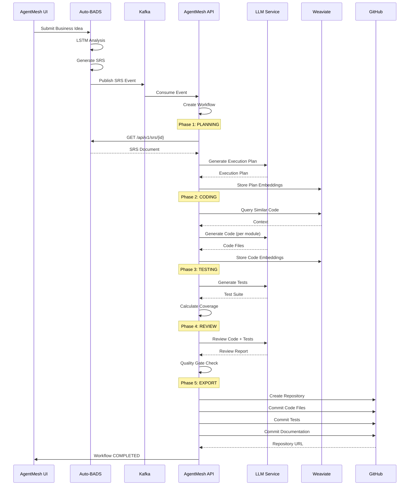

# AgentMesh Phase Implementation Design

**Date**: December 5, 2025  
**Status**: Design Phase - Not Yet Implemented  
**Purpose**: Detailed design for end-to-end workflow phases before implementation

---

## 🎯 Executive Summary

Currently, workflows complete all phases but produce only placeholder/fallback responses. This document outlines the detailed design for implementing **real agent intelligence** in each phase, with proper integration between Auto-BADS (SRS generation) and AgentMesh (code generation).

---

## 📊 Current State Analysis

### What Works ✅
1. **Auto-BADS** successfully:
   - Ingests business ideas
   - Generates SRS documents with LSTM-based analysis
   - Publishes events to Kafka (`autobads.srs.generated`)
   - Stores comprehensive SRS in database

2. **AgentMesh API** successfully:
   - Consumes Kafka events from Auto-BADS
   - Creates workflow instances
   - Progresses through all phases (PLANNING → CODING → TESTING → REVIEW)
   - Stores blackboard entries
   - Updates workflow status to COMPLETED

3. **Database Schema** is fully initialized with:
   - `blackboard_entry` table for agent collaboration
   - Multi-tenancy support (tenants, projects)
   - Audit and billing tracking

### What's Missing ❌
1. **No real AI/LLM integration** - agents return hardcoded fallback responses
2. **Blackboard content is incomplete** - only storing IDs instead of actual content
3. **No SRS utilization** - Auto-BADS SRS is not being used by AgentMesh agents
4. **No code generation** - no actual code files are created
5. **No GitHub integration** - code is not exported to repositories
6. **No vector memory** - Weaviate is running but not used for context retrieval

---

## 🏗️ Architecture Overview

```
┌─────────────────┐
│   User (UI)     │
│  Submit Idea    │
└────────┬────────┘
         │
         ▼
┌─────────────────┐         ┌──────────────────┐
│   Auto-BADS     │─────────│  PostgreSQL      │
│                 │  Store  │  (autobads DB)   │
│ • Market Agent  │◄────────│  • business_ideas│
│ • Financial     │         │  • srs_documents │
│ • Solution      │         └──────────────────┘
│ • SRS Gen       │
└────────┬────────┘
         │ Publish Event
         ▼
    ┌─────────┐
    │  Kafka  │ autobads.srs.generated
    └────┬────┘
         │ Consume
         ▼
┌─────────────────┐         ┌──────────────────┐
│  AgentMesh API  │─────────│  PostgreSQL      │
│                 │  Store  │  (agentmesh DB)  │
│ • Planner       │◄────────│  • blackboard    │
│ • Coder         │         │  • workflows     │
│ • Tester        │         │  • projects      │
│ • Reviewer      │         └──────────────────┘
└────────┬────────┘
         │
         ├──────────────► Weaviate (Vector Memory)
         │
         ├──────────────► LLM (OpenAI/Mock)
         │
         └──────────────► GitHub (Export)
```

---

## 📝 Detailed Phase Design

### Phase 1: PLANNING (Planner Agent)

#### Input
- SRS Document from Auto-BADS via Kafka event
- Project context (if existing)
- Technology preferences (from SRS)

#### Processing Steps
1. **Retrieve SRS** from Auto-BADS API
   ```
   GET http://localhost:8083/api/v1/srs/{srsId}
   ```

2. **Parse SRS** to extract:
   - Functional requirements
   - Non-functional requirements
   - Technology stack recommendations
   - Architecture suggestions

3. **Generate Execution Plan** using LLM:
   ```
   Prompt Template:
   ---
   You are a Software Architect planning a development project.
   
   SRS Summary:
   {srs_summary}
   
   Requirements:
   {functional_requirements}
   
   Generate a detailed execution plan with:
   1. Module breakdown
   2. File structure
   3. Development phases
   4. Dependencies
   5. Testing strategy
   ---
   ```

4. **Store in Blackboard**:
   ```json
   {
     "agent_id": "planner-agent",
     "entry_type": "PLAN",
     "title": "Execution Plan",
     "content": {
       "srs_id": "uuid",
       "modules": [
         {
           "name": "backend-api",
           "files": ["server.js", "routes.js", "models.js"],
           "tech_stack": ["Node.js", "Express", "MongoDB"]
         }
       ],
       "file_structure": {...},
       "development_phases": [...],
       "testing_strategy": {...}
     }
   }
   ```

5. **Store in Vector Memory** (Weaviate):
   - Embed execution plan for future retrieval
   - Tag with project_id, srs_id, phase

#### Output
- Structured execution plan in blackboard
- Vector embeddings in Weaviate
- Status: PLANNING → CODING

---

### Phase 2: CODING (Coder Agent)

#### Input
- Execution Plan from blackboard (Phase 1)
- SRS Document for context
- Previous code iterations (if any)

#### Processing Steps
1. **Retrieve Context**:
   - Get execution plan from blackboard
   - Get SRS from Auto-BADS API
   - Query Weaviate for similar implementations

2. **Generate Code Module by Module** using LLM:
   ```
   For each module in execution_plan.modules:
     Prompt Template:
     ---
     You are a Senior Software Engineer.
     
     Module: {module.name}
     Technology: {module.tech_stack}
     Requirements: {module.requirements}
     File Structure: {module.files}
     
     Generate production-ready code for each file:
     1. {file1}: [description]
     2. {file2}: [description]
     
     Follow best practices:
     - Clean code principles
     - Error handling
     - Documentation
     - Security
     ---
   ```

3. **Code Quality Checks**:
   - Syntax validation
   - Linting (if applicable)
   - Security scan basics

4. **Store in Blackboard**:
   ```json
   {
     "agent_id": "coder-agent",
     "entry_type": "CODE",
     "title": "Generated Code",
     "content": {
       "modules": [
         {
           "name": "backend-api",
           "files": [
             {
               "path": "server.js",
               "content": "const express = require('express');\n...",
               "language": "javascript",
               "size_bytes": 2048
             }
           ]
         }
       ],
       "total_files": 15,
       "total_lines": 1247
     }
   }
   ```

5. **Store Code in Vector Memory**:
   - Embed code snippets for semantic search
   - Enable code reuse and pattern matching

#### Output
- Complete codebase in blackboard
- Code embeddings in Weaviate
- Status: CODING → TESTING

---

### Phase 3: TESTING (Tester Agent)

#### Input
- Generated Code from blackboard (Phase 2)
- Execution Plan (testing strategy)
- SRS (test requirements)

#### Processing Steps
1. **Retrieve Context**:
   - Get generated code from blackboard
   - Get testing strategy from execution plan
   - Get functional requirements from SRS

2. **Generate Test Cases** using LLM:
   ```
   For each module:
     Prompt Template:
     ---
     You are a QA Engineer writing comprehensive tests.
     
     Module: {module.name}
     Code: {module.code}
     Requirements: {requirements}
     
     Generate test cases:
     1. Unit tests for each function
     2. Integration tests for APIs
     3. Edge case coverage
     4. Error handling validation
     
     Use framework: {test_framework}
     ---
   ```

3. **Test Coverage Analysis**:
   - Calculate coverage percentage
   - Identify untested code paths
   - Flag critical gaps

4. **Store in Blackboard**:
   ```json
   {
     "agent_id": "tester-agent",
     "entry_type": "TEST",
     "title": "Test Suite",
     "content": {
       "test_files": [
         {
           "path": "tests/server.test.js",
           "content": "describe('Server', () => {...});",
           "test_count": 24,
           "coverage_target": 85
         }
       ],
       "total_tests": 156,
       "coverage_analysis": {
         "unit_tests": 120,
         "integration_tests": 24,
         "e2e_tests": 12
       }
     }
   }
   ```

5. **Quality Metrics**:
   - Test coverage percentage
   - Critical path coverage
   - Performance test inclusion

#### Output
- Comprehensive test suite in blackboard
- Test coverage report
- Status: TESTING → REVIEW

---

### Phase 4: REVIEW (Reviewer Agent)

#### Input
- Generated Code (Phase 2)
- Test Suite (Phase 3)
- Execution Plan (Phase 1)
- SRS Document

#### Processing Steps
1. **Comprehensive Review** using LLM:
   ```
   Prompt Template:
   ---
   You are a Senior Code Reviewer performing a thorough review.
   
   Code: {all_code}
   Tests: {all_tests}
   Requirements: {srs_requirements}
   
   Review checklist:
   1. Requirements alignment
   2. Code quality & best practices
   3. Test coverage adequacy
   4. Security vulnerabilities
   5. Performance considerations
   6. Documentation completeness
   7. Architectural soundness
   
   Provide:
   - Approval status (APPROVED/NEEDS_CHANGES/REJECTED)
   - Critical issues
   - Recommendations
   - Overall quality score
   ---
   ```

2. **Automated Quality Gates**:
   - Test coverage > 80%
   - No critical security issues
   - All requirements addressed
   - Code complexity within limits

3. **Store in Blackboard**:
   ```json
   {
     "agent_id": "reviewer-agent",
     "entry_type": "REVIEW",
     "title": "Code Review Report",
     "content": {
       "status": "APPROVED",
       "quality_score": 8.5,
       "critical_issues": [],
       "recommendations": [
         "Add input validation to API endpoints",
         "Improve error messages"
       ],
       "metrics": {
         "test_coverage": 87.3,
         "code_complexity": "medium",
         "security_score": 9.2
       },
       "approved_for_export": true
     }
   }
   ```

4. **Decision Logic**:
   ```
   IF approved_for_export == true:
     → Proceed to GitHub Export
   ELSE:
     → Send feedback to Coder Agent
     → Iterate (back to CODING phase)
   ```

#### Output
- Detailed review report in blackboard
- Approval decision
- Status: REVIEW → COMPLETED (if approved)

---

### Phase 5: EXPORT (GitHub Integration)

#### Input
- Approved Code from blackboard
- Approved Tests from blackboard
- Project metadata

#### Processing Steps
1. **Repository Setup**:
   - Check if repo exists (GitHub API)
   - Create new repo if needed
   - Initialize with README

2. **Code Organization**:
   ```
   project-name/
   ├── README.md
   ├── .gitignore
   ├── package.json / requirements.txt
   ├── src/
   │   ├── server.js
   │   ├── routes.js
   │   └── models.js
   ├── tests/
   │   └── server.test.js
   └── docs/
       ├── SRS.md (from Auto-BADS)
       └── ARCHITECTURE.md (from Planner)
   ```

3. **Commit Strategy**:
   - Initial commit: Project structure
   - Second commit: Source code
   - Third commit: Tests
   - Fourth commit: Documentation

4. **GitHub API Calls**:
   ```javascript
   // Create repository
   POST /user/repos
   
   // Create files
   PUT /repos/{owner}/{repo}/contents/{path}
   
   // Create README with project summary
   PUT /repos/{owner}/{repo}/contents/README.md
   ```

5. **Store Export Metadata**:
   ```json
   {
     "agent_id": "github-exporter",
     "entry_type": "EXPORT",
     "title": "GitHub Export Complete",
     "content": {
       "repository_url": "https://github.com/user/project",
       "commit_sha": "abc123...",
       "files_exported": 15,
       "export_timestamp": "2025-12-05T17:42:00Z"
     }
   }
   ```

#### Output
- Code pushed to GitHub
- Repository URL
- Status: COMPLETED

---

## 🔄 Integration Flow

### End-to-End Workflow



---

## 🎨 UI Enhancement Design

### Workflow Detail View

Each phase should display rich, actionable information:

#### Planning Phase UI
```
┌─────────────────────────────────────────────┐
│ 📋 Planning Phase                    ✅ Done │
├─────────────────────────────────────────────┤
│ Agent: planner-agent                         │
│ Duration: 12.3s                              │
│                                              │
│ 📊 Execution Plan Summary                    │
│ • 3 modules identified                       │
│ • 15 files to generate                       │
│ • Tech Stack: Node.js, Express, MongoDB      │
│                                              │
│ 📁 File Structure                            │
│   backend-api/                               │
│   ├── server.js                              │
│   ├── routes/                                │
│   │   ├── auth.js                            │
│   │   └── users.js                           │
│   └── models/                                │
│       └── User.js                            │
│                                              │
│ [View Full Plan] [Download JSON]             │
└─────────────────────────────────────────────┘
```

#### Coding Phase UI
```
┌─────────────────────────────────────────────┐
│ 💻 Coding Phase                      ✅ Done │
├─────────────────────────────────────────────┤
│ Agent: coder-agent                           │
│ Duration: 45.7s                              │
│                                              │
│ 📈 Code Generation Stats                     │
│ • Files Generated: 15                        │
│ • Total Lines: 1,247                         │
│ • Languages: JavaScript (100%)               │
│                                              │
│ 📝 Generated Files                           │
│   ✓ server.js (142 lines)                    │
│   ✓ routes/auth.js (87 lines)                │
│   ✓ routes/users.js (94 lines)               │
│   ✓ models/User.js (63 lines)                │
│   ... and 11 more                            │
│                                              │
│ [Browse Code] [Download ZIP]                 │
└─────────────────────────────────────────────┘
```

#### Testing Phase UI
```
┌─────────────────────────────────────────────┐
│ 🧪 Testing Phase                     ✅ Done │
├─────────────────────────────────────────────┤
│ Agent: tester-agent                          │
│ Duration: 23.4s                              │
│                                              │
│ 📊 Test Coverage                             │
│ ██████████████████░░ 87.3%                   │
│                                              │
│ 🎯 Test Breakdown                            │
│ • Unit Tests: 120                            │
│ • Integration Tests: 24                      │
│ • E2E Tests: 12                              │
│ • Total: 156 tests                           │
│                                              │
│ ✅ Coverage Goals Met                        │
│ Target: >80% | Actual: 87.3%                 │
│                                              │
│ [View Tests] [Coverage Report]               │
└─────────────────────────────────────────────┘
```

#### Review Phase UI
```
┌─────────────────────────────────────────────┐
│ 👁️ Review Phase                      ✅ APPROVED │
├─────────────────────────────────────────────┤
│ Agent: reviewer-agent                        │
│ Duration: 18.2s                              │
│                                              │
│ ⭐ Quality Score: 8.5/10                     │
│                                              │
│ ✅ Quality Gates                             │
│ ✓ Test Coverage (87.3% > 80%)                │
│ ✓ Security Score (9.2/10)                    │
│ ✓ Code Complexity (Medium)                   │
│ ✓ All Requirements Met                       │
│                                              │
│ 💡 Recommendations (2)                       │
│ • Add input validation to API endpoints      │
│ • Improve error messages                     │
│                                              │
│ 🚀 Status: APPROVED FOR EXPORT               │
│                                              │
│ [Full Review Report]                         │
└─────────────────────────────────────────────┘
```

#### Export Phase UI
```
┌─────────────────────────────────────────────┐
│ 📤 Export Phase                      ✅ Done │
├─────────────────────────────────────────────┤
│ Agent: github-exporter                       │
│ Duration: 8.7s                               │
│                                              │
│ 🎉 Successfully Exported to GitHub           │
│                                              │
│ 📦 Repository                                │
│ https://github.com/user/project-name         │
│                                              │
│ 📊 Export Summary                            │
│ • Files Committed: 15                        │
│ • Documentation: 3 files                     │
│ • Commit SHA: abc123def456                   │
│                                              │
│ [Open in GitHub] [Clone URL]                 │
└─────────────────────────────────────────────┘
```

---

## 🗄️ Data Model Design

### Blackboard Entry Enhanced Schema

```sql
-- Current schema (already exists)
CREATE TABLE blackboard_entry (
    id BIGSERIAL PRIMARY KEY,
    tenant_id VARCHAR(36),
    project_id VARCHAR(36),
    data_partition_key VARCHAR(255),
    agent_id VARCHAR(255),
    entry_type VARCHAR(50),
    title VARCHAR(500),
    content TEXT,  -- JSON structure
    timestamp TIMESTAMP,
    version INTEGER,
    parent_entry_id BIGINT
);

-- Content JSON structure per phase:
```

**PLAN Entry Content**:
```json
{
  "srs_id": "uuid",
  "srs_url": "http://localhost:8083/api/v1/srs/{id}",
  "modules": [
    {
      "name": "string",
      "description": "string",
      "tech_stack": ["string"],
      "files": ["string"],
      "dependencies": ["string"],
      "priority": "high|medium|low"
    }
  ],
  "file_structure": {
    "root": "project-name",
    "directories": {},
    "files": []
  },
  "development_phases": ["phase1", "phase2"],
  "testing_strategy": {
    "unit_tests": true,
    "integration_tests": true,
    "e2e_tests": true,
    "target_coverage": 80
  },
  "estimated_effort": "40 hours",
  "technology_justification": "string"
}
```

**CODE Entry Content**:
```json
{
  "modules": [
    {
      "name": "string",
      "files": [
        {
          "path": "string",
          "content": "string",
          "language": "string",
          "size_bytes": 0,
          "lines": 0,
          "hash": "sha256"
        }
      ]
    }
  ],
  "total_files": 0,
  "total_lines": 0,
  "total_bytes": 0,
  "languages": {"javascript": 15, "python": 5},
  "complexity_metrics": {
    "cyclomatic_complexity": "medium",
    "maintainability_index": 75
  }
}
```

**TEST Entry Content**:
```json
{
  "test_files": [
    {
      "path": "string",
      "content": "string",
      "test_count": 0,
      "framework": "jest|pytest|...",
      "coverage_target": 85
    }
  ],
  "total_tests": 0,
  "coverage_analysis": {
    "unit_tests": 0,
    "integration_tests": 0,
    "e2e_tests": 0,
    "total_coverage_pct": 87.3
  },
  "uncovered_paths": ["path1", "path2"],
  "critical_gaps": []
}
```

**REVIEW Entry Content**:
```json
{
  "status": "APPROVED|NEEDS_CHANGES|REJECTED",
  "quality_score": 8.5,
  "critical_issues": [
    {
      "severity": "high|medium|low",
      "category": "security|performance|quality",
      "description": "string",
      "file": "string",
      "line": 0,
      "recommendation": "string"
    }
  ],
  "recommendations": ["string"],
  "metrics": {
    "test_coverage": 87.3,
    "code_complexity": "low|medium|high",
    "security_score": 9.2,
    "performance_score": 8.0,
    "maintainability_score": 7.5
  },
  "requirements_traceability": {
    "total_requirements": 24,
    "addressed": 24,
    "missing": []
  },
  "approved_for_export": true,
  "reviewer_notes": "string"
}
```

**EXPORT Entry Content**:
```json
{
  "repository_url": "https://github.com/user/repo",
  "repository_owner": "string",
  "repository_name": "string",
  "commit_sha": "string",
  "branch": "main",
  "files_exported": 0,
  "export_timestamp": "ISO8601",
  "export_manifest": [
    {
      "local_path": "string",
      "github_path": "string",
      "commit_sha": "string",
      "size_bytes": 0
    }
  ]
}
```

---

## 🔌 LLM Integration Strategy

### Configuration

```yaml
# application.yml
agentmesh:
  llm:
    openai:
      enabled: true  # Set to true when API key available
      api-key: ${OPENAI_API_KEY}
      model: gpt-4o  # or gpt-4-turbo
      embedding-model: text-embedding-3-small
      temperature: 0.7
      max-tokens: 4000
    
    # Fallback for development
    mock:
      enabled: true  # Use when OpenAI disabled
      response-type: structured  # Return structured data
```

### Service Design

```java
public interface LLMService {
    // Code generation
    CodeGenerationResponse generateCode(CodeGenerationRequest request);
    
    // Test generation
    TestGenerationResponse generateTests(TestGenerationRequest request);
    
    // Code review
    ReviewResponse reviewCode(ReviewRequest request);
    
    // Planning
    ExecutionPlanResponse generateExecutionPlan(PlanningRequest request);
}

// OpenAI Implementation
@Service
@ConditionalOnProperty("agentmesh.llm.openai.enabled")
public class OpenAILLMService implements LLMService {
    // Real OpenAI API integration
}

// Mock Implementation  
@Service
@ConditionalOnProperty("agentmesh.llm.mock.enabled")
public class MockLLMService implements LLMService {
    // Structured mock responses for development
}
```

---

## 📦 Implementation Phases

### Phase A: Foundation (Week 1)
1. ✅ **Database Schema** - Already complete
2. ✅ **Kafka Integration** - Already working
3. 🔄 **LLM Service Interface** - Design and implement
4. 🔄 **Blackboard Content Structure** - Enhance JSON schemas

### Phase B: Agent Intelligence (Week 2-3)
1. **Planner Agent Enhancement**
   - Integrate with Auto-BADS SRS API
   - Implement LLM-based plan generation
   - Store detailed execution plans

2. **Coder Agent Enhancement**
   - Implement module-by-module code generation
   - Add syntax validation
   - Store complete codebase

3. **Tester Agent Enhancement**
   - Implement test case generation
   - Add coverage analysis
   - Store comprehensive test suites

4. **Reviewer Agent Enhancement**
   - Implement multi-criteria review
   - Add quality gates
   - Store detailed review reports

### Phase C: Vector Memory (Week 4)
1. **Weaviate Integration**
   - Schema design for code/plans/tests
   - Embedding generation
   - Semantic search implementation

2. **Context Retrieval**
   - Similar code patterns
   - Best practices library
   - Project history

### Phase D: GitHub Export (Week 5)
1. **GitHub API Integration**
   - Repository creation
   - File upload
   - Commit management

2. **Export Orchestration**
   - File organization
   - Documentation generation
   - Metadata tracking

### Phase E: UI Enhancement (Week 6)
1. **Phase Detail Views**
   - Rich content display
   - Code viewer
   - Metrics visualization

2. **Export Links**
   - GitHub repository links
   - Download options
   - Clone instructions

---

## 🧪 Testing Strategy

### Unit Tests
- Each agent service independently
- LLM service mocking
- Blackboard operations

### Integration Tests
- End-to-end workflow execution
- Kafka event processing
- Database persistence

### System Tests
- Full workflow with real Auto-BADS
- GitHub export verification
- Performance benchmarks

---

## 📊 Success Metrics

### Phase Implementation Success
- ✅ Workflow completes with real code (not placeholders)
- ✅ Blackboard contains detailed, structured content
- ✅ UI displays rich phase information
- ✅ Code is exportable to GitHub
- ✅ Vector memory enables context retrieval

### Quality Metrics
- Code generation time: < 2 minutes per module
- Test coverage: > 80% target achieved
- Review accuracy: > 90% requirement traceability
- Export success rate: > 95%

---

## 🚀 Next Steps

### Immediate Actions (Before Implementation)
1. **Review this design document** with stakeholders
2. **Validate LLM integration approach** (OpenAI vs. alternatives)
3. **Confirm GitHub integration requirements**
4. **Approve JSON schemas** for blackboard content
5. **Prioritize implementation phases**

### Decision Points
- [ ] Use OpenAI API (requires API key) or alternative LLM?
- [ ] GitHub integration: OAuth app or personal tokens?
- [ ] Weaviate vector memory: essential for Phase 1 or can be deferred?
- [ ] UI enhancement: parallel with backend or sequential?

---

## 📚 References

- AgentMesh Architecture: `/COMPREHENSIVE_DEVELOPMENT_PLAN.md`
- Auto-BADS Integration: `/GITHUB_EXPORT_IMPLEMENTATION.md`
- Database Schema: `/AgentMesh/src/main/resources/db/migration/V1__initial_schema.sql`
- Current Status: `/AgentMesh/WORKFLOW_FIX_SUMMARY.md`

---

**Status**: ✅ Design Complete - Ready for Review  
**Next**: Stakeholder Approval → Implementation Kickoff
